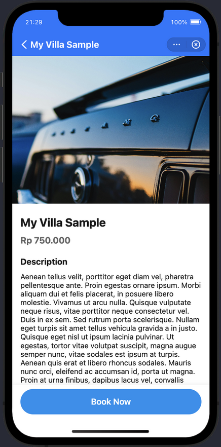
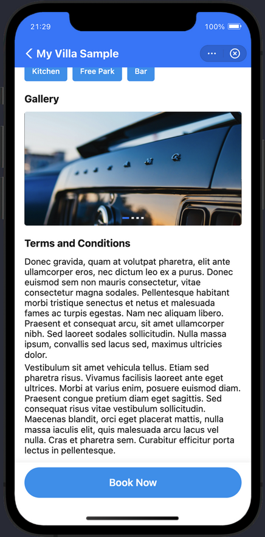
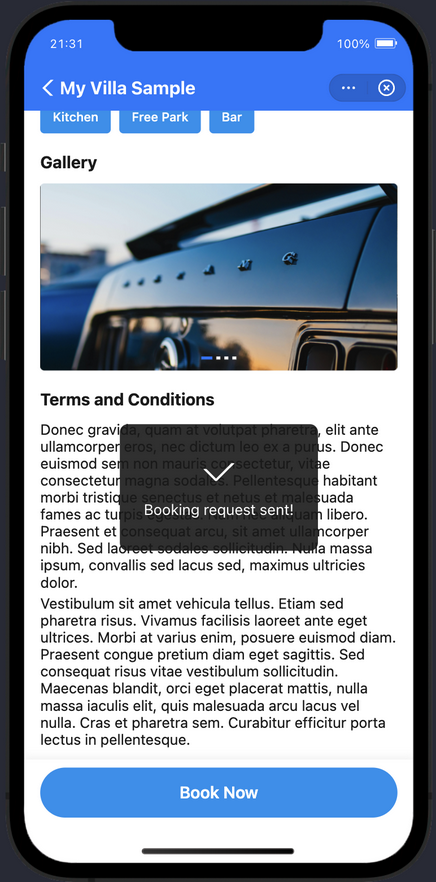

# Property Listing Mini App — DANA Technical Assessment

A full-stack property listing application built with **Go backend** and **DANA Mini Program frontend**, demonstrating clean architecture, modern UI/UX, and scalable design patterns.

---

## � Table of Contents

- [Project Overview](#-project-overview)
- [Quick Start](#-quick-start)
- [Running the Backend](#-running-the-backend)
- [Running the Mini Program](#-running-the-mini-program)
- [Environment Configuration](#-environment-configuration)
- [Architecture](#-architecture)
- [Screenshots](#-screenshots)
- [Documentation](#-documentation)
- [Technology Stack](#-technology-stack)
- [Testing](#-testing)
- [Troubleshooting](#-troubleshooting)

---

## 📖 Project Overview

This project is a property listing application that allows users to browse, search, and view property details. It consists of:

- **Backend**: RESTful API built with Go using Clean Architecture
- **Frontend**: DANA Mini Program with component-based architecture
- **Features**: Property search, layout toggle (list/grid), image carousel, pull-to-refresh

### Project Structure

```
property-listing-mini-app/
├── backend/                    # Go REST API
│   ├── cmd/api/               # Application entry point
│   ├── internal/              # Clean architecture layers
│   ├── data/                  # JSON data source
│   └── docs/                  # API specification (OpenAPI 3.0)
├── frontend/                   # DANA Mini Program
│   ├── pages/                 # Screens (about, listing, detail)
│   ├── components/            # Reusable UI components
│   ├── api/                   # API client layer
│   ├── services/              # Business logic services
│   └── assets/                # Images and static files
└── screenshots/               # Application screenshots
```

---

## 🚀 Quick Start

### Prerequisites

- **Go** 1.25+ (for backend)
- **DANA Mini Program IDE** (for frontend)
- **Node.js** 18+ (optional, for frontend config scripts)

---

## 🖥️ Running the Backend

### Step 1: Navigate to Backend Directory

```bash
cd backend
```

### Step 2: Start the Server

**Option 1: Using Go (Development)**

```bash
go run cmd/api/main.go
```

**Option 2: Using Makefile**

```bash
# Development mode (default)
make run

# Staging mode
make run-staging

# Production mode
make run-prod
```

The API will be available at **`http://localhost:8080/api/v1`**

### Step 3: Verify Server is Running

```bash
# Test API endpoint
curl http://localhost:8080/api/v1/properties

# Expected: JSON response with property listings
```

### API Endpoints

| Endpoint | Method | Description |
|----------|--------|-------------|
| `/api/v1/properties` | GET | List all properties (supports `?search={query}`) |
| `/api/v1/properties/{id}` | GET | Get property detail by ID |

**📚 For detailed backend architecture, see [`backend/README.md`](backend/README.md)**

---

## 📱 Running the Mini Program

### Step 1: Open DANA Mini Program IDE

Download and install the latest version of **DANA Mini Program IDE**.

### Step 2: Import the Project

1. Open **DANA Mini Program IDE**
2. Click **File** → **Import Project**
3. Select the `frontend/` directory
4. Click **Open**

### Step 3: Configure Environment (Optional)

**For Simulator (Default)**:
- No configuration needed
- Uses `http://localhost:8080/api/v1` by default

**For Physical Device Testing**:

```bash
cd frontend

# Copy environment template
cp .env.example .env

# Edit .env and set your computer's IP address
# Example: API_BASE_URL=http://192.168.1.100:8080/api/v1

# Generate config
npm run config:dev
```

### Step 4: Run the Simulator

1. Ensure the backend is running
2. Click the **Run** button in the IDE
3. The simulator will launch with the app

### IDE Requirements

- **DANA Mini Program IDE** (latest version)
- **Minimum OS**: macOS 10.14+ / Windows 10+
- **RAM**: 4GB minimum, 8GB recommended

**📚 For detailed frontend architecture, see [`frontend/README.md`](frontend/README.md)**

---

## 🔧 Environment Configuration

Both backend and frontend support multiple environments (development, staging, production) without code changes.

### Backend Environment Variables

| Variable | Default | Description |
|----------|---------|-------------|
| `ENV` | `development` | Environment name |
| `PORT` | `8080` | Server port |
| `DATA_PATH` | `data/properties.json` | JSON data file path |
| `CORS_ALLOW_ORIGIN` | `*` | CORS allowed origin |
| `LOG_LEVEL` | `info` | Logging level |

**How to Switch Environments:**

```bash
cd backend

# Development (default)
make run

# Staging
make run-staging

# Production
make run-prod
```

**Using .env file:**

```bash
cd backend
cp .env.example .env
# Edit .env with your values
export $(cat .env | xargs) && go run cmd/api/main.go
```

### Frontend Environment Variables

| Variable | Default | Description |
|----------|---------|-------------|
| `ENV` | `development` | Environment name |
| `API_BASE_URL` | `http://localhost:8080/api/v1` | Backend API URL |
| `TIMEOUT` | `10000` | Request timeout (ms) |
| `RETRY_ATTEMPTS` | `2` | Number of retry attempts |

**How to Switch Environments:**

```bash
cd frontend

# Development (default)
npm run config:dev

# Staging
npm run config:staging

# Production
npm run config:prod
```

**Using .env file for custom configuration:**

```bash
cd frontend
cp .env.example .env
# Edit .env with your values
npm run config:dev
```

**Environment Presets:**

| Environment | API Base URL |
|-------------|--------------|
| `development` | `http://localhost:8080/api/v1` |
| `staging` | `https://staging-api.example.com/api/v1` |
| `production` | `https://api.example.com/api/v1` |

---

## 🏗️ Architecture

### Backend Architecture (Go)

**Clean Architecture** with strict layer separation:

```
HTTP Request
    ↓
Middleware (CORS, Logging)
    ↓
Delivery Layer (HTTP handlers)
    ↓
Use Case Layer (business logic)
    ↓
Repository Layer (data access)
    ↓
Domain Layer (entities & interfaces)
```

**Key Principles**:
- Dependency injection for testability
- Interface-based design
- Repository pattern for data abstraction
- Structured logging (JSON)

**📚 Detailed architecture: [`backend/README.md`](backend/README.md)**

### Frontend Architecture (DANA Mini Program)

**Component-based architecture**:

```
Pages (AXML + JS + ACSS)
    ↓
Components (reusable UI)
    ↓
Services (business logic)
    ↓
API Client (HTTP layer)
    ↓
Backend API
```

**Key Features**:
- AXML templating
- ACSS styling
- Component lifecycle management
- State management with `setData()`
- Pull-to-refresh support
- Loading & empty states

**📚 Detailed architecture: [`frontend/README.md`](frontend/README.md)**

---

## � Screenshots

### About Page


### Property Listing - List View


### Property Listing - Grid View


### Property Listing - Search


### Property Detail




---

## � Documentation

### Main Documentation
- **Backend Architecture & API**: [`backend/README.md`](backend/README.md)
- **Frontend Architecture & Components**: [`frontend/README.md`](frontend/README.md)

### API Documentation
- **API Documentation**: [`backend/docs/README.md`](backend/docs/README.md)
- **OpenAPI Specification**: [`backend/docs/api-spec.yaml`](backend/docs/api-spec.yaml)

### Additional Resources
- **Edge Cases Handling**: [`frontend/EDGE_CASES.md`](frontend/EDGE_CASES.md)

---

## 🛠️ Technology Stack

### Backend

| Component | Technology |
|-----------|-----------|
| Language | Go 1.25.0 |
| HTTP Framework | `net/http` (stdlib) |
| Architecture | Clean Architecture |
| Data Source | JSON file |
| Logging | `log/slog` (stdlib) |
| API Spec | OpenAPI 3.0 |

### Frontend

| Component | Technology |
|-----------|-----------|
| Framework | DANA Mini Program |
| Markup | AXML (Ant XML) |
| Styling | ACSS (Ant CSS) |
| Scripting | JavaScript (ES6+) |
| HTTP Client | `my.request` |

---

## 🧪 Testing

### Backend Tests

```bash
cd backend

# Run all tests
go test ./... -v

# Run with coverage
go test ./... -cover
```

**Test Coverage**:
- Repository layer (JSON data access)
- Use case layer (business logic)
- Mock-based testing

### Frontend Testing

Manual testing checklist:
- ✅ About page displays correctly
- ✅ Property listing loads
- ✅ Search filters by title
- ✅ Layout toggle (list/grid)
- ✅ Property detail view
- ✅ Image carousel
- ✅ Pull-to-refresh
- ✅ Loading states
- ✅ Empty states

---

## 🐛 Troubleshooting

### Backend Issues

**Port already in use:**
```bash
lsof -ti:8080 | xargs kill -9
```

**Data file not found:**
```bash
# Ensure file exists
ls -la backend/data/properties.json

# Or set custom path
DATA_PATH=/path/to/data.json go run cmd/api/main.go
```

### Frontend Issues

**Cannot connect to backend:**
- Ensure backend is running: `curl http://localhost:8080/api/v1/properties`
- For physical devices, use your computer's IP in `.env`
- Check firewall settings

**Mini Program IDE errors:**
- Use the latest DANA Mini Program IDE
- Clear cache and restart IDE
- Verify `app.json` configuration

**Properties not loading:**
- Check API configuration in `frontend/config/env.js`
- Verify network connectivity
- Check browser/IDE console for errors

---

## 🎯 Features

### Frontend Features
- About screen with app information
- Property listing with search
- Layout toggle (list/grid view)
- Property detail with image carousel
- Pull-to-refresh
- Loading & empty states
- Book Now demo action

### Backend Features
- RESTful API
- Search functionality
- CORS support
- Structured logging
- Error handling
- Unit tests

---

## 📄 License

MIT

---

## 👤 Author

**Abi Fauzan**  
Email: abifauzan234@gmail.com  
GitHub: [@abifauzan](https://github.com/abifauzan)

---

## 🙏 Acknowledgments

Built as part of the **DANA Technical Assessment** for the Property Listing Mini App challenge.

**Technologies Used**:
- Go standard library (`net/http`, `log/slog`)
- DANA Mini Program Framework
- Clean Architecture principles
- RESTful API design patterns
