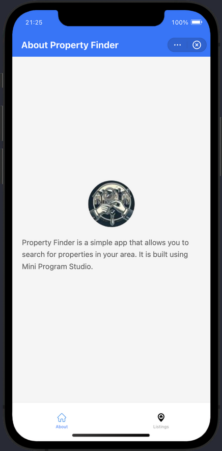
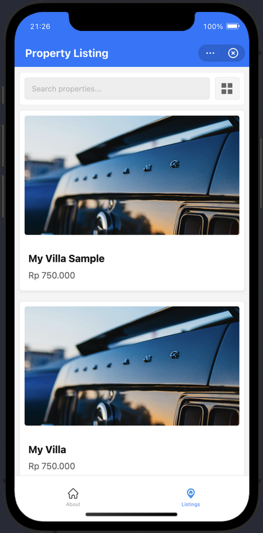
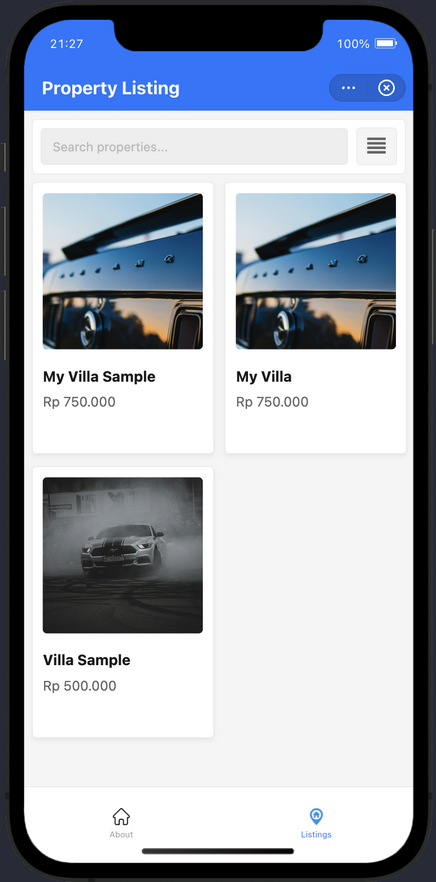
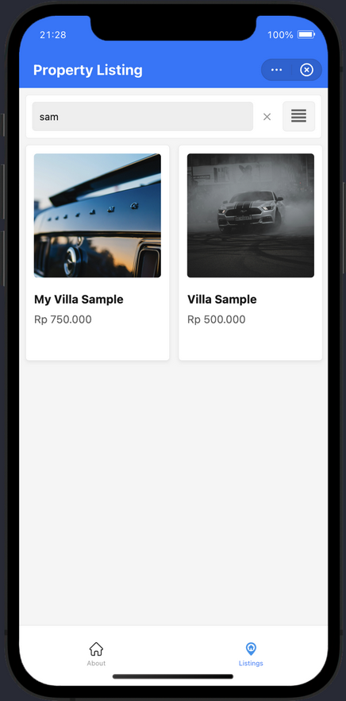

# Property Listing Mini App — DANA Technical Assessment

A full-stack property listing application built with **Go backend** and **DANA Mini Program frontend**, demonstrating clean architecture, modern UI/UX, and scalable design patterns.

---

## 📦 Project Structure

```
property-listing-mini-app/
├── backend/                    # Go REST API
│   ├── cmd/api/               # Application entry point
│   ├── internal/              # Clean architecture layers
│   │   ├── domain/           # Business entities & interfaces
│   │   ├── repository/       # Data access layer (JSON)
│   │   ├── usecase/          # Business logic
│   │   ├── delivery/http/    # HTTP handlers & routing
│   │   └── middleware/       # CORS & logging
│   ├── data/                 # JSON data source
│   └── docs/                 # API specification (OpenAPI 3.0)
├── frontend/                  # DANA Mini Program
│   ├── pages/                # Screens (about, listing, detail)
│   ├── components/           # Reusable UI components
│   ├── api/                  # API client layer
│   ├── services/             # Business logic services
│   ├── utils/                # Helper functions
│   └── assets/               # Images and static files
└── data/                     # JSON schemas (reference)
```

---

## 🚀 Quick Start

### Prerequisites

- **Go** 1.25+ (backend)
- **DANA Mini Program IDE** (frontend)
- **Node.js** 18+ (optional, for tooling)

### 1. Start the Backend API

```bash
cd backend
go run cmd/api/main.go
```

The API will be available at **`http://localhost:8080/api/v1`**

### 2. Open the Mini Program

1. Open **DANA Mini Program IDE**
2. Import the `frontend/` directory as a project
3. Click **Run** to start the simulator
4. The app will connect to the backend automatically

---

## 🏗️ Architecture Overview

### Backend (Go)

**Clean Architecture** with strict layer separation:

```
HTTP Request
    ↓
Middleware (CORS, Logging)
    ↓
Delivery Layer (HTTP handlers)
    ↓
Use Case Layer (business logic)
    ↓
Repository Layer (data access)
    ↓
Domain Layer (entities & interfaces)
```

**Key Principles**:
- Dependency injection for testability
- Interface-based design
- Single responsibility per layer
- Repository pattern for data abstraction
- Structured logging (JSON)

### Frontend (DANA Mini Program)

**Component-based architecture** following mini-program conventions:

```
Pages (AXML + JS + ACSS)
    ↓
Components (reusable UI)
    ↓
Services (business logic)
    ↓
API Client (HTTP layer)
    ↓
Backend API
```

**Key Features**:
- AXML templating (mini-program markup)
- ACSS styling (mini-program CSS)
- Component lifecycle management
- State management with `setData()`
- Pull-to-refresh support
- Loading & empty states

---

## 📡 API Endpoints

| Endpoint | Method | Query Params | Description |
|----------|--------|--------------|-------------|
| `/api/v1/properties` | GET | `?search={query}` | List properties (with optional search) |
| `/api/v1/properties/{id}` | GET | — | Get property detail by ID |

### Example Requests

```bash
# Get all properties
curl http://localhost:8080/api/v1/properties

# Search properties by title
curl http://localhost:8080/api/v1/properties?search=villa

# Get property detail
curl http://localhost:8080/api/v1/properties/x0zzhpyrox8ixdy75e2zpw1m
```

**Response Format**:
```json
{
  "data": {
    "propertyListings": [
      {
        "documentId": "x0zzhpyrox8ixdy75e2zpw1m",
        "Banner": { "url": "https://..." },
        "Title": "My Villa Sample",
        "Price": "750000",
        "createdAt": "2025-01-31T08:18:56.778Z"
      }
    ]
  }
}
```

---

## 🎯 Features

### ✅ Frontend Features (DANA Mini Program)

- **About Screen** — Static information page with app description
- **Property Listing** — Browse all properties with search
- **Search Bar** — Real-time filtering by property title
- **Layout Toggle** — Switch between vertical list and grid view
- **Property Detail** — Full property information with image carousel
- **Image Gallery** — Swipeable carousel with pagination dots
- **Pull-to-Refresh** — Reload property data
- **Loading States** — Skeleton screens during data fetch
- **Empty States** — User-friendly messages for no results
- **Book Now** — Demo booking action (shows toast)

### ✅ Backend Features (Go API)

- **RESTful API** — Standard HTTP methods
- **Search Functionality** — Case-insensitive title search
- **CORS Support** — Cross-origin requests enabled
- **Error Handling** — Structured error responses
- **Structured Logging** — JSON logs with request/response details
- **Clean Architecture** — Testable, maintainable codebase
- **Unit Tests** — Repository and use case tests included

---

## 🛠️ Technology Stack

### Backend

| Component | Technology | Version |
|-----------|-----------|---------|
| Language | Go | 1.25.0 |
| HTTP Framework | `net/http` (stdlib) | — |
| Architecture | Clean Architecture | — |
| Data Source | JSON file | — |
| Logging | `log/slog` (stdlib) | — |
| API Spec | OpenAPI 3.0 | — |

### Frontend

| Component | Technology |
|-----------|-----------|
| Framework | DANA Mini Program |
| Markup | AXML (Ant XML) |
| Styling | ACSS (Ant CSS) |
| Scripting | JavaScript (ES6+) |
| HTTP Client | `my.request` (mini-program API) |
| Components | Custom components |

---

## 🧪 Testing

### Backend Tests

```bash
cd backend
go test ./... -v
```

**Test Coverage**:
- Repository layer tests (JSON data access)
- Use case layer tests (business logic)
- Mock-based testing with interfaces

### Frontend Testing

Manual testing checklist:
- ✅ About page displays correctly
- ✅ Listing page loads properties
- ✅ Search filters properties by title
- ✅ Layout toggle switches views
- ✅ Detail page shows full property info
- ✅ Image carousel swipes correctly
- ✅ Pull-to-refresh reloads data
- ✅ Loading states appear during fetch
- ✅ Empty state shows when no results
- ✅ Book Now shows confirmation toast

---

## � Screenshots

### About Page


### Property Listing - List View


### Property Listing - Grid View


### Property Listing - Search


### Property Detail


---

## �📚 Documentation

- **Backend README**: [`backend/README.md`](backend/README.md)
- **API Documentation**: [`backend/docs/README.md`](backend/docs/README.md)
- **API Spec (OpenAPI)**: [`backend/docs/api-spec.yaml`](backend/docs/api-spec.yaml)
- **Frontend README**: [`frontend/README.md`](frontend/README.md)

---

## 🔧 Configuration

### Backend Environment Variables

| Variable | Default | Description |
|----------|---------|-------------|
| `PORT` | `8080` | Server listen port |
| `DATA_PATH` | `data/properties.json` | Path to JSON data file |

### Frontend API Configuration

Update `frontend/api/config.js` to change the backend URL:

```javascript
const API_BASE_URL = 'http://localhost:8080';
```

For physical device testing, use your computer's IP address:

```javascript
const API_BASE_URL = 'http://192.168.1.100:8080';
```

---

## 🚢 Deployment

### Backend

Build and run the binary:

```bash
cd backend
go build -o property-api cmd/api/main.go
./property-api
```

Or deploy to a cloud provider (e.g., Google Cloud Run, AWS Lambda, Heroku).

### Frontend

Package the mini-program and submit to the DANA Mini Program platform following their deployment guidelines.

---

## 📝 Development Workflow

1. **Start Backend**:
   ```bash
   cd backend && go run cmd/api/main.go
   ```

2. **Open Mini Program IDE**:
   - Import `frontend/` directory
   - Click **Run** to start simulator

3. **Make Changes**:
   - Backend: Edit files in `internal/`
   - Frontend: Edit files in `pages/`, `components/`

4. **Test**:
   - Backend: `go test ./...`
   - Frontend: Manual testing in simulator

---

## 🎨 Design Decisions

### Why Go for Backend?

- **Performance**: Fast compilation and execution
- **Simplicity**: Strong standard library, minimal dependencies
- **Scalability**: Excellent concurrency support
- **Type Safety**: Compile-time error checking
- **Clean Architecture**: Natural fit for layered design

### Why DANA Mini Program?

- **Requirement**: Specified in the technical assessment
- **Ecosystem**: Integrated with DANA platform
- **Performance**: Lightweight and fast
- **User Base**: Direct access to DANA users

### Why Clean Architecture?

- **Testability**: Each layer can be tested independently
- **Maintainability**: Clear separation of concerns
- **Scalability**: Easy to add new features
- **Flexibility**: Can swap data sources without changing business logic

---

## 🔄 Future Enhancements

### Backend
- [ ] Database integration (PostgreSQL/MongoDB)
- [ ] Authentication & authorization (JWT)
- [ ] Pagination for large datasets
- [ ] Advanced filtering (price range, facilities)
- [ ] Image upload service
- [ ] Rate limiting
- [ ] API versioning

### Frontend
- [ ] Favorites/wishlist functionality
- [ ] Advanced filters (price, location, facilities)
- [ ] Map view integration
- [ ] User authentication
- [ ] Booking history
- [ ] Push notifications
- [ ] Offline mode with local storage

---

## 🐛 Troubleshooting

### Backend Issues

**Port already in use:**
```bash
lsof -ti:8080 | xargs kill -9
```

**Data file not found:**
Ensure `backend/data/properties.json` exists or set `DATA_PATH` environment variable.

### Frontend Issues

**Cannot connect to backend:**
- Ensure backend is running on `http://localhost:8080`
- For physical devices, update API URL to your computer's IP
- Check firewall settings

**Mini Program IDE errors:**
- Ensure you're using the latest DANA Mini Program IDE
- Clear cache and restart IDE
- Check `app.json` for configuration errors

---

## 📄 License

MIT

---

## 👤 Author

**Abi Fauzan**  
Email: abifauzan234@gmail.com  
GitHub: [@abifauzan](https://github.com/abifauzan)

---

## 🙏 Acknowledgments

Built as part of the **DANA Technical Assessment** for the Property Listing Mini App challenge.

**Technologies Used**:
- Go standard library (`net/http`, `log/slog`)
- DANA Mini Program Framework
- Clean Architecture principles
- RESTful API design patterns
